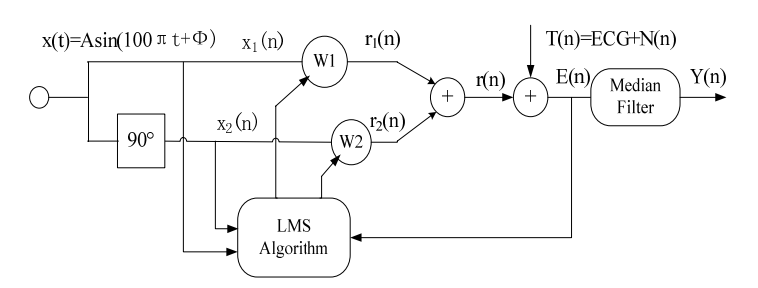

# Repository for the ZOMB project at the Gdańsk University of Technology

## Table of contents
* [General info](#general-info)
* [Technologies](#technologies)
* [Database](#database)
* [Adaptive filter](#adaptive-filter)
* [Alogorithm](#alogorithm)
* [Bibliography](#bibliography)

## General info
This project is an adaptive filter for denoising network disturbances from the ECG signal	
## Technologies
Project is created with:
* Matlab R2020a
## Database 
You can find all the signals used [here](https://physionet.org/content/ecgiddb/1.0.0/)
## Adaptive filter

## Algorithm
Our filter consists of two main parts:
### FIR filter
It is an adaptive filter with a learning vector of the coefficients based on the LMS algorithm.
#### Reference signals
These are two generated sine and cosine signals with a frequency of 50 Hz, with a constant amplitude and no phase shift.
#### LMS Alogorithm
The LMS algorithm aims to update the FIR filter coefficient vector based on the provided reference signal, feedback signal, learning factor and the current coefficient vector.
#### Mathematical formulas
The gradient descent algorithm can be written as:
* 
The reference signal is:
* 
The filter output is:
* 
### Median filter
Median filter can effectively prevent outburst pulse from interfering.
#### Mathematical formulas
Median filter output:
* 
The final output is: 
* 
## Bibliography
To find out more check out the following articles:
* [Y. Weiting and Z. Runjing, "An Improved Self-Adaptive Filter Based on LMS Algorithm for Filtering 50Hz Interference in ECG Signals," 2007 8th International Conference on Electronic Measurement and Instruments, Xi'an, 2007, pp. 3-874-3-878, doi: 10.1109/ICEMI.2007.4351057.](https://ieeexplore-1ieee-1org-1000007ft0dc2.han.bg.pg.edu.pl/document/4351057)
